# DealFlow360 — Data Flow Architecture

> **Comprehensive Technical Architecture & Data Flow Specification**  
> *This document describes how data moves through the DealFlow360 Intelligent Sales Operations Platform—from user interactions in the React frontend through role-based authentication, Express API controllers, business logic services, PostgreSQL persistence via Prisma ORM, AI recommendation analysis, to response delivery and state synchronization.*

---

## Table of Contents

1. [System Overview](#1-system-overview)
2. [Users & Roles Architecture](#2-users--roles-architecture)
3. [Frontend Data Flow & State Management](#3-frontend-data-flow--state-management)
4. [Authentication & Security Data Flow](#4-authentication--security-data-flow)
5. [Quotation Lifecycle Data Flow](#5-quotation-lifecycle-data-flow)
6. [Discount Governance & Risk Approval Data Flow](#6-discount-governance--risk-approval-data-flow)
7. [Product Catalog & Price List Data Flow](#7-product-catalog--price-list-data-flow)
8. [Warehouse, Multi-Facility Inventory & Fulfillment Data Flow](#8-warehouse-multi-facility-inventory--fulfillment-data-flow)
9. [Sales Order Architecture & Data Flow](#9-sales-order-architecture--data-flow)
10. [Subscriptions, Billing Schedules & Invoicing Data Flow](#10-subscriptions-billing-schedules--invoicing-data-flow)
11. [Customer Portal Data Flow](#11-customer-portal-data-flow)
12. [Customer Negotiation & Counter-Proposal Flow](#12-customer-negotiation--counter-proposal-flow)
13. [AI Deal Advisor & Recommendation Architecture](#13-ai-deal-advisor--recommendation-architecture)
14. [RAG Chatbot Architecture & Knowledge Base Specification](#14-rag-chatbot-architecture--knowledge-base-specification)
15. [Executive Reporting & Analytics Data Flow](#15-executive-reporting--analytics-data-flow)
16. [Database Schema & Entity Relationship Model](#16-database-schema--entity-relationship-model)
17. [Complete End-to-End Enterprise Sales Data Flow](#17-complete-end-to-end-enterprise-sales-data-flow)
18. [Data Ownership & Single Source of Truth](#18-data-ownership--single-source-of-truth)
19. [Error Propagation & Failure Handling Flow](#19-error-propagation--failure-handling-flow)
20. [Security & Access Boundary Architecture](#20-security--access-boundary-architecture)
21. [Technology Stack](#21-technology-stack)
22. [Complete REST API Catalog](#22-complete-rest-api-catalog)
23. [Data Flow Architectural Legend](#23-data-flow-architectural-legend)
24. [Core Architectural Principles](#24-core-architectural-principles)
25. [Module Implementation Status & Audit Matrix](#25-module-implementation-status--audit-matrix)

---

## 1. System Overview

DealFlow360 is built on an enterprise multi-tier decoupled architecture:
* **Frontend Layer**: Single Page Application (SPA) developed in React 18, TypeScript, and Vite, styled with Tailwind CSS v4 and animated using Framer Motion.
* **API Gateway & Routing Layer**: Express.js HTTP engine operating on Node.js, utilizing CORS, Helmet, JSON body parsing, and route rate limiting.
* **Security & RBAC Layer**: Stateless JWT authentication (access & refresh tokens) verified via Bearer headers, coupled with database-backed Role-Based Access Control (RBAC) and data isolation middleware.
* **Business Logic & Service Layer**: Specialized domain services executing Decimal mathematical calculations, discount governance rule evaluation, composite risk scoring, warehouse split allocation, and subscription schedule generators.
* **Database & ORM Layer**: PostgreSQL (hosted on Neon Serverless DB) managed via Prisma ORM with strict foreign key constraints, relational mapping, and ACID transactions.
* **Intelligence Layer**: Rule-based AI cross-sell/upsell recommendation engines, margin impact evaluation, and live customer negotiation thread management.

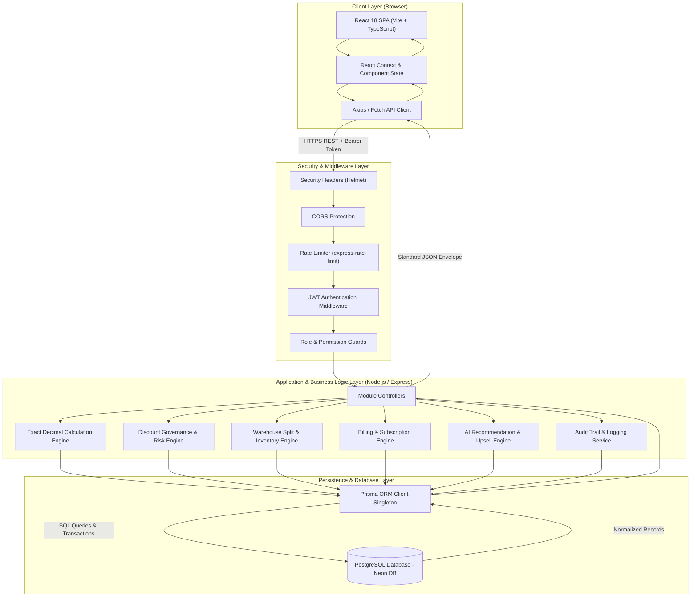

---

## 2. Users & Roles Architecture

The platform enforces strict role-based access. Navigation menus, route guards, API endpoints, and database queries are partitioned by the authenticated user's role:

| Role Identifier | Portal / Workspace | Permitted Operations & Access Scope |
|---|---|---|
| `ADMIN` | `/management` & All Modules | Complete administrative access: User management, global discount/approval rule configurations, audit logs, and override authority across all business entities. |
| `SALES_REP` | `/sales/workspace`, `/sales/quotations` | Quotation creation and editing, AI Deal Advisor recommendations, discount requests, customer record management, and assigned deal tracking. Restricted from approving deals. |
| `SALES_MANAGER` | `/management/approvals`, `/management/reports` | Tier 1 approval execution (low-to-medium risk quotations), approval rule review, sales rep performance oversight, and sales pipeline analytics. |
| `FINANCE` | `/operations/invoices`, `/operations/payments` | Tier 2 approval execution (high-risk discount exceptions), invoice generation, payment reconciliation, credit notes, and subscription schedules. |
| `OPERATIONS` | `/operations/fulfillment`, `/operations/orders` | Conversion of customer-confirmed quotes into Sales Orders, warehouse stock management, split fulfillment dispatch, carrier tracking, and backorder queue management. |
| `CUSTOMER` | `/customer/portal`, `/customer/quotations` | Customer self-service portal: Quotation review, counter-proposal negotiation chat, discount change requests, self-service order confirmation, and invoice viewing. Strictly isolated to owned records. |

---

## 3. Frontend Data Flow & State Management

The frontend user interface adheres to a unidirectional data flow pattern:

```mermaid
flowchart LR
    User["User Interaction\n(Click / Input)"] --> Component["React Component\n(e.g., QuoteBuilder.tsx)"]
    Component --> LocalState["Component State\n(useState / useReducer)"]
    LocalState --> ApiService["API Service Layer\n(e.g., quotations.api.ts)"]
    ApiService --> Network["HTTP Request\n(fetch with Bearer Token)"]
    Network --> Response["HTTP JSON Response\n({ success, data, error })"]
    Response --> GlobalContext["AuthContext / Toast Provider"]
    GlobalContext --> ReRender["UI DOM Update\n(Tailwind CSS + Lucide Icons)"]
```

### Key Frontend Architecture Highlights:
* **Routing & Route Protection (`frontend/src/App.tsx`, `RoleRoute.tsx`)**: Routes are wrapped in `<RoleRoute allowedRoles={[...]}>`. If an unauthenticated user attempts access, they are redirected to `/login`. If an authenticated user attempts access outside their role permissions, they are redirected to `/unauthorized`.
* **Centralized API Client (`frontend/src/services/api.ts` & `frontend/src/api/index.ts`)**: Handles base URL routing, automatic injection of `Authorization: Bearer <accessToken>`, interceptors for handling token refreshes, and standard response unwrapping.
* **Authentication Context (`frontend/src/context/AuthContext.tsx`)**: Manages the persistent session, current user metadata, assigned role permissions, active portal route, and authorized navigation items returned dynamically from `/api/navigation`.
* **Component Architecture**: Reusable UI atoms (`Button.tsx`, `Card.tsx`, `Badge.tsx`, `Table.tsx`, `Modal.tsx`) provide a cohesive enterprise design system.

---

## 4. Authentication & Security Data Flow

Authentication is stateless and token-based, backed by secure bcrypt password hashing and optional OTP two-factor verification.

```mermaid
sequenceDiagram
    autonumber
    actor User
    participant UI as Login Page (React)
    participant AuthCtrl as auth.controller.js
    participant AuthService as auth.service.js
    participant RBAC as rbac.service.js
    participant DB as PostgreSQL (User & Roles)

    User->>UI: Enters email and password
    UI->>AuthCtrl: POST /api/auth/login { email, password }
    AuthCtrl->>AuthService: login({ email, password })
    AuthService->>DB: findByEmail(email)
    DB-->>AuthService: User Record (password_hash, status, role)
    AuthService->>AuthService: bcrypt.compare(password, password_hash)
    AuthService->>RBAC: getUserAuthContext(user.id)
    RBAC->>DB: Query Role, Permissions, RolePortal, NavigationItems
    DB-->>RBAC: Role metadata & Navigation graph
    RBAC-->>AuthService: Auth Context { user, portal, navigation, permissions }
    AuthService->>AuthService: Generate Access Token (JWT 15m) & Refresh Token (JWT 7d)
    AuthService-->>AuthCtrl: Tokens + Auth Context
    AuthCtrl-->>UI: 200 OK { message, accessToken, refreshToken, user, portal, navigation }
    UI->>UI: Store tokens in LocalStorage; Update AuthContext state
    UI->>User: Redirect to authorized Portal (e.g. /sales/dashboard or /customer/dashboard)
```

---

## 5. Quotation Lifecycle Data Flow

The Quotation lifecycle is the core transaction engine of DealFlow360. All mathematical calculations are computed on the backend using exact Decimal precision to eliminate JavaScript floating-point rounding errors.

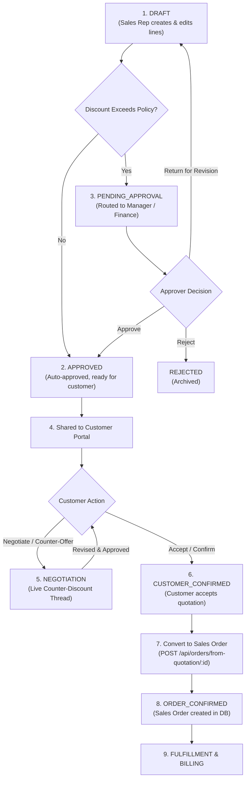

---

## 6. Discount Governance & Risk Approval Data Flow

DealFlow360 implements an automated multi-tier discount risk engine based on customer tiers, category-specific ceilings, and blended margin impact.

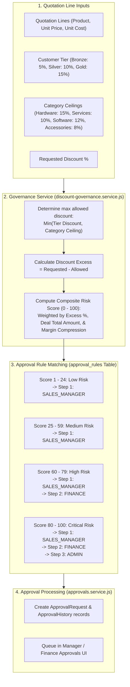

---

## 7. Product Catalog & Price List Data Flow

Product data serves as the foundation for quotation line items and inventory stock tracking:

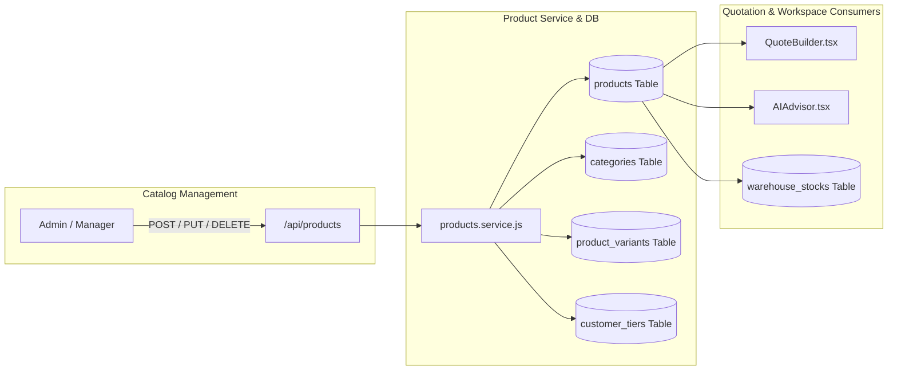

---

## 8. Warehouse, Multi-Facility Inventory & Fulfillment Data Flow

Fulfillment operations handle multi-warehouse inventory checks, stock reservation, automated split allocations, and backorder queuing.

```mermaid
sequenceDiagram
    autonumber
    actor Ops as Operations Specialist
    participant UI as Fulfillment UI (React)
    participant FulfillCtrl as fulfillment.controller.js
    participant FulfillService as fulfillment.service.js
    participant DB as PostgreSQL (WarehouseStock & Orders)

    Ops->>UI: Selects Sales Order for fulfillment
    UI->>FulfillCtrl: POST /api/fulfillment/allocate { orderId, warehouseAllocations? }
    FulfillCtrl->>FulfillService: allocateOrder(orderId, warehouseAllocations)
    FulfillService->>DB: Query SalesOrderLines & WarehouseStock (WH-AMD-01, WH-BDQ-01)
    DB-->>FulfillService: Current available & reserved inventory quantities
    
    alt Stock Fully Available in Primary Warehouse
        FulfillService->>DB: Reserve stock & create 1 FulfillmentOrder (Status: READY)
    else Stock Split Across Warehouses
        FulfillService->>DB: Create Split FulfillmentOrders (Order WH-1 + Order WH-2)
    else Stock Insufficient (Partial Shortage)
        FulfillService->>DB: Fulfill available quantity; Create Backorder record for balance
    end

    FulfillService-->>FulfillCtrl: Fulfillment Orders & Allocated Batches
    FulfillCtrl-->>UI: 200 OK { fulfillmentOrders, backorders }
    
    Ops->>UI: Clicks "Dispatch / Ship" with tracking number
    UI->>FulfillCtrl: POST /api/fulfillment/:id/dispatch { carrier, trackingNumber }
    FulfillCtrl->>FulfillService: dispatchFulfillmentOrder(id, trackingInfo)
    FulfillService->>DB: Decrement warehouse_stocks.quantity; Set status to SHIPPED
    FulfillService->>DB: Update SalesOrder status (PARTIALLY_FULFILLED or FULFILLED)
    FulfillCtrl-->>UI: 200 OK { status: 'SHIPPED' }
```

---

## 9. Sales Order Architecture & Data Flow

Sales Orders represent finalized, binding commitments converted from approved and customer-confirmed quotations.

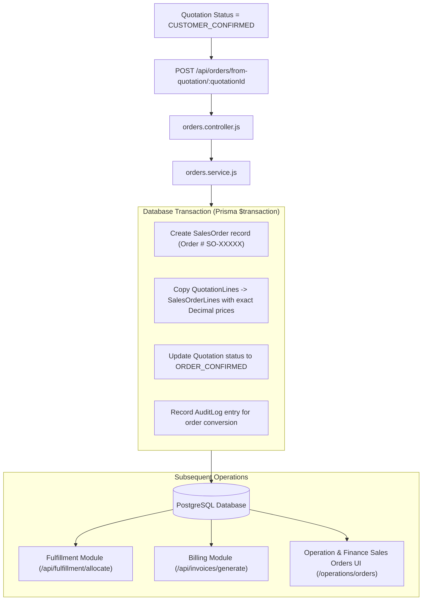

---

## 10. Subscriptions, Billing Schedules & Invoicing Data Flow

DealFlow360 natively supports hybrid quotations containing both one-time products and recurring subscription contracts.

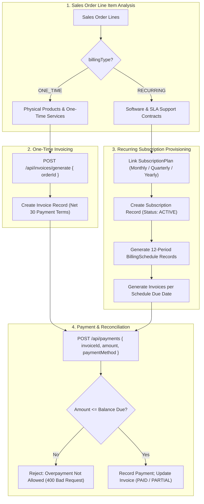

---

## 11. Customer Portal Data Flow

The Customer Portal provides a secure, self-service environment strictly isolated from internal operational data.

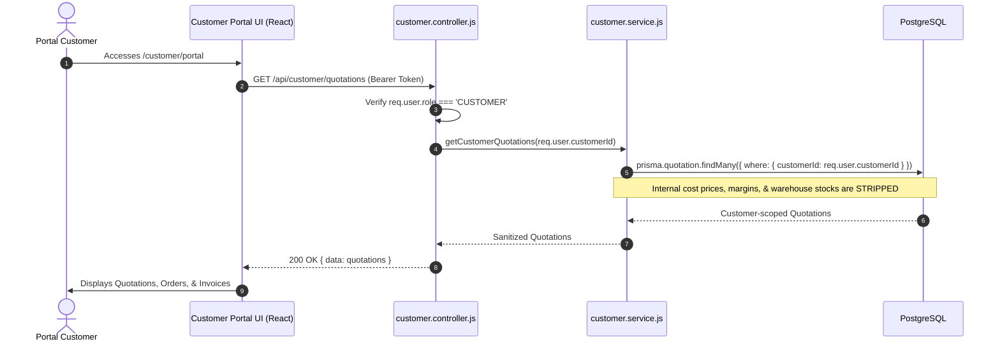

---

## 12. Customer Negotiation & Counter-Proposal Flow

Customers can submit live counter-proposals or request adjustments directly from their portal quotation view.

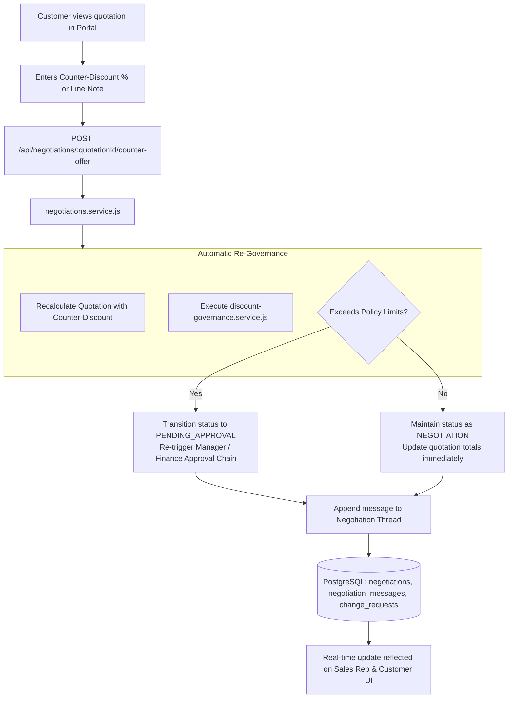

---

## 13. AI Deal Advisor & Recommendation Architecture

The AI Deal Advisor evaluates active quotation lines in real time, calculating companion product pairings, productivity recommendations, and margin impact deltas.

```mermaid
flowchart LR
    subgraph Client["Sales Rep Workspace"]
        Builder["QuoteBuilder.tsx"] -->|Selects Quote| RecAPI["GET /api/quotations/:id/recommendations"]
    end

    subgraph Logic["AI Recommendation Engine (recommendations.service.js)"]
        RecAPI --> InspectLines["Inspect existing product IDs on quotation"]
        InspectLines --> FilterAvailable["Find complementary catalog items not in quote"]
        FilterAvailable --> MatchHeuristics["Companion Matching Rules:\n* Laptop -> Docking Station (0.95 score)\n* Laptop -> 4K Monitor (0.88 score)\n* Workstation -> Ergonomic Mouse/Keyboard (0.80 score)"]
        MatchHeuristics --> MarginAnalysis["Calculate Financial Delta:\n* Additional Revenue Impact\n* Additional Margin Impact ($ & %)"]
    end

    subgraph Action["Action & Re-Calculation"]
        MarginAnalysis --> RecResponse["Ranked Recommendations Array"]
        RecResponse --> AdvisorUI["AIAdvisor.tsx / Inline Recommendation Card"]
        AdvisorUI -->|Clicks 'Add to Quote'| AddAPI["POST /api/recommendations/add { recId }"]
        AddAPI --> RecalcQuote["Quotation totals, tax, and blended margin update live"]
    end
```

---

## 14. RAG Chatbot Architecture & Knowledge Base Specification

### Actual Codebase State vs Planned Architecture
* **Current Implementation State**: **⚠️ Planned / Specification Phase**
* In the current codebase, natural language query processing is represented by the **AI Deal Advisor rule engine** and the **Customer Negotiation chat module**.
* A full document-ingesting Retrieval-Augmented Generation (RAG) pipeline utilizing vector embeddings and an external LLM is designed as an architectural extension as specified below:

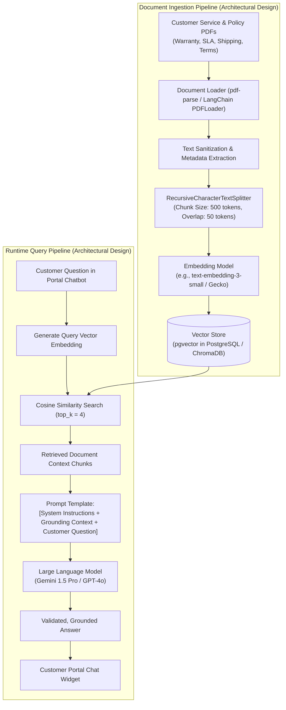

### Knowledge Base Categorization Matrix:
When ingested, the RAG knowledge base partitions information into structured domain buckets:
1. **Product Specifications**: Technical sheets for Hardware (Latitude Laptops, 4K Displays, Thunderbolt Docks).
2. **Pricing & Discount Policies**: Customer tier thresholds, maximum allowable discounts, and approval criteria.
3. **Fulfillment & Logistics**: Warehouse dispatch SLAs, carrier options, shipping weight formulas, and backorder timelines.
4. **Billing & Subscriptions**: Net-30 payment terms, recurring subscription cancellation, proration policies, and credit notes.
5. **Customer Portal FAQs**: How to counter-propose quotations, order confirmation steps, and tracking shipment status.

---

## 15. Executive Reporting & Analytics Data Flow

Reporting analytics are generated by aggregating transactional records directly from PostgreSQL:

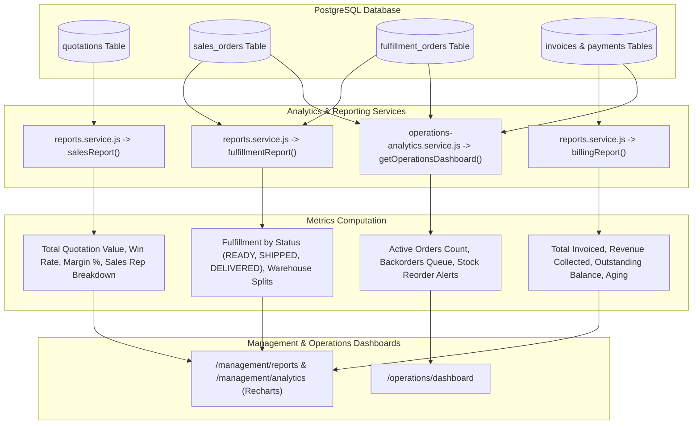

---

## 16. Database Schema & Entity Relationship Model

The following Mermaid ER diagram illustrates the actual relationships defined in `prisma/schema.prisma`:

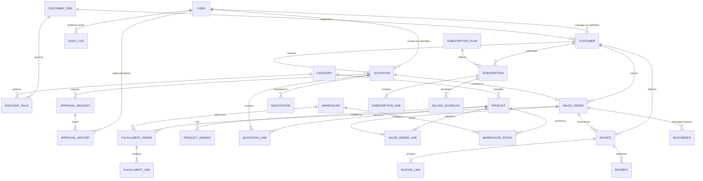

---

## 17. Complete End-to-End Enterprise Sales Data Flow

This unified diagram traces a transaction from initial sales representative authentication through quotation creation, multi-tier risk evaluation, approval governance, customer negotiation, order conversion, warehouse split fulfillment, invoicing, and executive reporting.

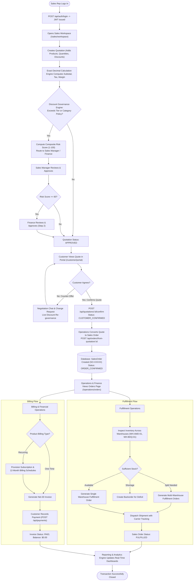

---

## 18. Data Ownership & Single Source of Truth

To maintain strict data integrity, the system strictly designates authoritative sources of truth:

| Business Domain Entity | Authoritative Source of Truth | Mutability Rules |
|---|---|---|
| Users, Credentials & Roles | PostgreSQL `users`, `roles` tables | Mutable only via Admin / Auth services; passwords bcrypt hashed. |
| Products, Variants & Prices | PostgreSQL `products`, `product_variants` | Admin/Operations managed; historical prices locked upon quote creation. |
| Customer Tiers & Governance Rules | PostgreSQL `customer_tiers`, `discount_rules` | Authoritative policy tables; rules cannot be bypassed by frontend. |
| Approval Rules & Hierarchies | PostgreSQL `approval_rules` | Multi-step workflow definitions enforced by backend services. |
| Quotations & Line Items | PostgreSQL `quotations`, `quotation_lines` | Mutable only in `DRAFT` or `NEGOTIATION` status. Immutably locked once approved. |
| Sales Orders & Order Lines | PostgreSQL `sales_orders`, `sales_order_lines` | Created idempotently from quotations; immutable financial record. |
| Multi-Warehouse Stock Levels | PostgreSQL `warehouse_stocks` | Mutated only via transactional allocation/dispatch with negative stock checks. |
| Fulfillment Orders & Shipments | PostgreSQL `fulfillment_orders`, `fulfillment_lines` | Status transitions: `READY` $\rightarrow$ `PACKED` $\rightarrow$ `SHIPPED` $\rightarrow$ `DELIVERED`. |
| Subscriptions & Schedules | PostgreSQL `subscriptions`, `billing_schedules` | Automated cron/generator managed; status updates on renewal/cancellation. |
| Invoices & Payment Ledgers | PostgreSQL `invoices`, `payments` | Immutable financial transactions; payments balance verified on each transaction. |

---

## 19. Error Propagation & Failure Handling Flow

Errors are handled systematically without crashing the application or returning raw database exceptions to the client:

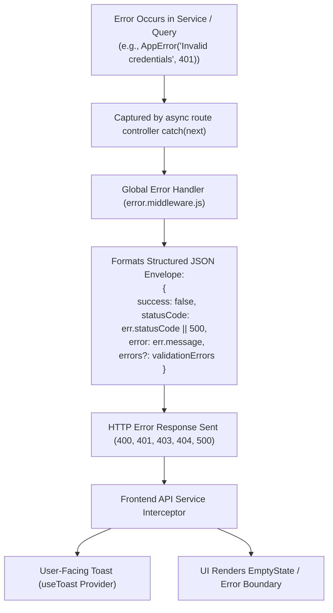

---

## 20. Security & Access Boundary Architecture

1. **Authentication Guard**: All `/api/*` routes (except `/api/auth/login`, `/api/auth/signup`, `/api/health`) require a valid Bearer JWT.
2. **Role Verification Guard (`requireRole([...])`)**: Checks `req.user.role` against authorized list. Violations immediately terminate with `403 Forbidden`.
3. **Tenant & Customer Scoping**:
   * Customer users have `req.user.customerId` stamped from their authenticated record.
   * Customer endpoints automatically inject `{ where: { customerId: req.user.customerId } }`.
   * Direct customer queries for unauthorized IDs fail with `404 Not Found` or `403 Forbidden`.
4. **Injection & Type Safety**:
   * All queries execute through Prisma ORM using parameterized SQL statements, eliminating SQL injection.
   * Input validation handled via Zod schemas and sanitization routines.

---

## 21. Technology Stack

| Layer | Component | Technology & Version | Purpose |
|---|---|---|---|
| **Frontend** | Framework | React 18.2.0 | Reactive component rendering |
| | Tooling & Bundler | Vite 5.0.0 | Fast HMR and optimized production bundling |
| | Language | TypeScript 5.3.2 | Static type safety across models and APIs |
| | Styling | Tailwind CSS v4.0.0 | Utility-first responsive styling and theme |
| | UI Icons & Motion | Lucide React + Framer Motion | Modern interface iconography and micro-interactions |
| | Charts & Visuals | Recharts 3.10.1 | Financial and operational analytics charts |
| **Backend** | Runtime & Framework | Node.js + Express 4.18.2 | High-throughput asynchronous REST API server |
| | Security Headers | Helmet 7.1.0 + CORS 2.8.5 | Cross-origin policies and header hardening |
| | Rate Limiting | express-rate-limit 7.1.4 | DoS prevention on API routes |
| | Authentication | jsonwebtoken 9.0.2 + bcryptjs 2.4.3 | Stateless JWT tokens and salt-hashed passwords |
| | OAuth Strategies | Passport 0.7.0 (Google & GitHub) | Third-party single sign-on integration |
| | Validation | Zod 3.22.4 | Runtime schema and parameter validation |
| **Database** | Database Engine | PostgreSQL 16 (Neon Serverless DB) | Relational ACID database |
| | ORM | Prisma Client 6.4.1 | Type-safe database queries, migrations, and seeds |
| **Intelligence** | Rule & Deal Engine | In-house TypeScript/JS Engine | Real-time discount governance, risk scoring & cross-sell |

---

## 22. Complete REST API Catalog

```
Authentication (/api/auth)
├── POST /api/auth/signup               -> User registration
├── POST /api/auth/login                -> User login (returns JWTs & RBAC context)
├── POST /api/auth/refresh              -> Refresh expired access token
├── POST /api/auth/verify-otp           -> Two-factor OTP validation
└── GET  /api/auth/me                   -> Current user profile

Products & Catalog (/api/products)
├── GET  /api/products                  -> List products with categories & filters
├── GET  /api/products/:id              -> Get single product details
├── POST /api/products                  -> Create product (Admin/Manager)
└── PUT  /api/products/:id              -> Update product details

Customers (/api/customers)
├── GET  /api/customers                 -> List customers (Scoped by role)
├── GET  /api/customers/:id             -> Customer details with tier
└── GET  /api/customers/tiers           -> List discount tiers (Bronze, Silver, Gold)

Quotations (/api/quotations)
├── GET  /api/quotations                -> List quotations with status filtering
├── GET  /api/quotations/:id            -> Single quotation with lines & audit trail
├── POST /api/quotations                -> Create quotation with exact Decimal math
├── PUT  /api/quotations/:id            -> Edit quotation (Draft / Negotiation status only)
├── POST /api/quotations/:id/discount-check -> Run discount governance & risk scoring
├── POST /api/quotations/:id/submit     -> Submit quote for approval routing
└── POST /api/quotations/:id/confirm    -> Customer quotation acceptance

Approvals (/api/approvals)
├── GET  /api/approvals                 -> List pending approvals for current role
├── POST /api/approvals/:id/approve     -> Approve quotation step
├── POST /api/approvals/:id/reject      -> Reject quotation
└── POST /api/approvals/:id/return      -> Return quotation to draft for revision

Sales Orders (/api/orders)
├── GET  /api/orders                    -> List database-persisted Sales Orders
├── GET  /api/orders/:id                -> Get single Sales Order details
└── POST /api/orders/from-quotation/:id -> Convert confirmed quote to Sales Order

Warehouses & Inventory (/api/warehouses, /api/inventory, /api/backorders)
├── GET  /api/warehouses                -> List fulfillment warehouses
├── GET  /api/inventory                 -> Multi-warehouse stock levels
└── GET  /api/backorders                -> List pending backorders

Fulfillment (/api/fulfillment)
├── GET  /api/fulfillment/orders        -> List fulfillment orders
├── POST /api/fulfillment/allocate      -> Automatic multi-warehouse split allocation
└── POST /api/fulfillment/:id/dispatch  -> Dispatch shipment with tracking number

Billing & Invoicing (/api/invoices, /api/payments, /api/subscriptions)
├── GET  /api/invoices                  -> List generated invoices
├── POST /api/invoices/generate         -> Create invoice from order or schedule
├── GET  /api/payments                  -> List recorded payments
├── POST /api/payments                  -> Record payment with overpayment prevention
└── GET  /api/subscriptions             -> List customer recurring subscriptions

Customer Portal (/api/customer)
├── GET  /api/customer/quotations       -> Customer-isolated quotations
├── GET  /api/customer/orders           -> Customer-isolated sales orders
└── GET  /api/customer/invoices         -> Customer-isolated invoices

Customer Negotiation (/api/negotiations)
├── GET  /api/negotiations/:quotationId/messages     -> Fetch negotiation thread
├── POST /api/negotiations/:quotationId/messages     -> Post negotiation message
└── POST /api/negotiations/:quotationId/counter-offer -> Submit counter-discount request

AI Recommendations (/api/recommendations)
├── GET  /api/quotations/:id/recommendations -> Fetch companion recommendations
├── POST /api/recommendations/add            -> Accept recommendation into quote
└── POST /api/recommendations/dismiss        -> Dismiss recommendation

Reports & Analytics (/api/reports, /api/analytics)
├── GET  /api/reports/sales             -> Executive sales performance report
├── GET  /api/reports/approvals         -> Approval turnaround and risk report
├── GET  /api/reports/fulfillment       -> Warehouse dispatch & fulfillment report
├── GET  /api/reports/billing           -> Financial collection & aging report
└── GET  /api/operations/dashboard      -> Real-time Operations & Finance KPI telemetry
```

---

## 23. Data Flow Architectural Legend

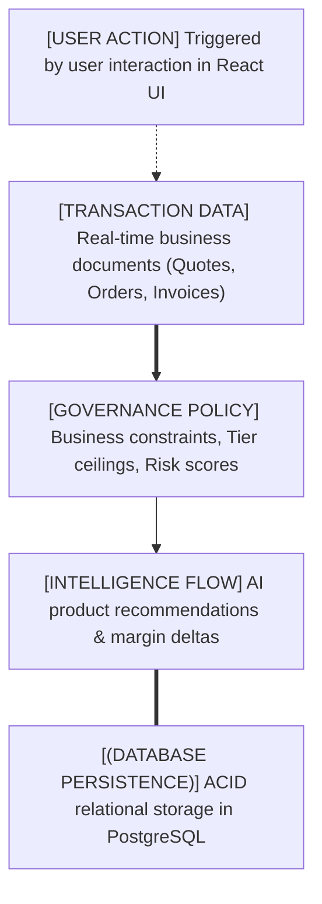

---

## 24. Core Architectural Principles

1. **Database as the Sole Source of Truth**: All operational states, quotations, inventory counts, and financial balances originate from PostgreSQL via Prisma ORM. No client-side mock arrays are treated as production data sources.
2. **API-Driven Frontend Architecture**: The React frontend is completely decoupled from database internals, interacting strictly through structured, versioned REST API endpoints.
3. **Backend-Enforced Business Governance**: Approval policies, discount ceilings, and fulfillment rules are computed and enforced on the server. The client cannot bypass business validation.
4. **Strict Role-Based Scoping**: Every API call verifies role authorization. Customer users are strictly sandboxed to their own tenant records without exposure to internal costs, margins, or warehouse allocations.
5. **Exact Decimal Financial Arithmetic**: All financial amounts, tax calculations, and discount percentages utilize exact Decimal operations to eliminate floating-point discrepancies.
6. **Complete Audit Traceability**: Key business events (quotation submissions, approvals, rejections, order conversions, and payments) are recorded immutably in `approval_history` and `audit_logs` tables with user IDs and timestamps.

---

## 25. Module Implementation Status & Audit Matrix

| Module / Workflow Area | Architecture Status | Database Connected | API Endpoint Active | Frontend Connected | Audit Verification Notes |
|---|---|---|---|---|---|
| **Authentication & RBAC** | ✅ Implemented | ✅ Yes (`users`, `roles`) | ✅ `/api/auth/*` | ✅ Yes | Multi-role login, JWTs, role route protection tested. |
| **Product & Price Lists** | ✅ Implemented | ✅ Yes (`products`, `tiers`) | ✅ `/api/products` | ✅ Yes | 10 products with cost, price, and categories loaded from DB. |
| **Discount Governance** | ✅ Implemented | ✅ Yes (`discount_rules`) | ✅ `/api/quotations/:id/discount-check` | ✅ Yes | 7 database discount rules enforced by governance service. |
| **Approval Chain** | ✅ Implemented | ✅ Yes (`approval_rules`) | ✅ `/api/approvals/*` | ✅ Yes | Multi-step approval routing, approval history logging verified. |
| **Quotation Engine** | ✅ Implemented | ✅ Yes (`quotations`) | ✅ `/api/quotations/*` | ✅ Yes | Quotation builder with Decimal calculations and persistence. |
| **Sales Orders** | ✅ Implemented | ✅ Yes (`sales_orders`) | ✅ `/api/orders/*` | ✅ Yes | 7 database orders retrieved via backend API; "Failed to load" bug resolved. |
| **Warehouse Fulfillment** | ✅ Implemented | ✅ Yes (`warehouses`, `stocks`) | ✅ `/api/fulfillment/*` | ✅ Yes | Multi-warehouse stock tracking, split allocation, and dispatch. |
| **Backorders Queue** | ✅ Implemented | ✅ Yes (`backorders`) | ✅ `/api/backorders` | ✅ Yes | Shortage detection and backorder tracking operational. |
| **Subscriptions & Billing** | ✅ Implemented | ✅ Yes (`subscriptions`) | ✅ `/api/subscriptions` | ✅ Yes | Plans, 12-month billing schedules, and recurring invoices. |
| **Invoicing & Payments** | ✅ Implemented | ✅ Yes (`invoices`, `payments`) | ✅ `/api/invoices`, `/api/payments` | ✅ Yes | Net-30 invoice generation, payments, overpayment guards. |
| **Customer Portal** | ✅ Implemented | ✅ Yes (Customer Scoped) | ✅ `/api/customer/*` | ✅ Yes | Customer-facing quote review, order tracking, and invoice view. |
| **Customer Negotiation** | ✅ Implemented | ✅ Yes (`negotiations`) | ✅ `/api/negotiations/*` | ✅ Yes | Live negotiation thread, counter-proposals, re-governance. |
| **AI Deal Advisor** | ✅ Implemented | ✅ Yes (`upsell_rules`) | ✅ `/api/recommendations/*` | ✅ Yes | Companion matching, score weighting, and margin delta update. |
| **RAG Chatbot** | ⚠️ Planned / Design Spec | ⚠️ Planned (pgvector) | ⚠️ Planned | ⚠️ Planned | Architectural design documented; awaiting vector store setup. |
| **Executive Reporting** | ✅ Implemented | ✅ Yes (Relational DB) | ✅ `/api/reports/*` | ✅ Yes | Aggregated sales, fulfillment, billing, and ops telemetry. |
